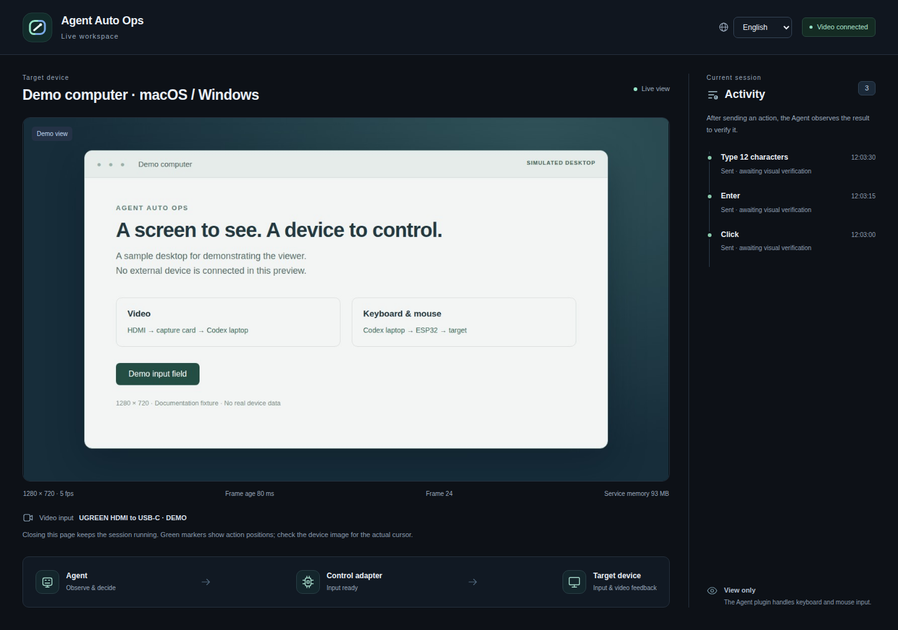
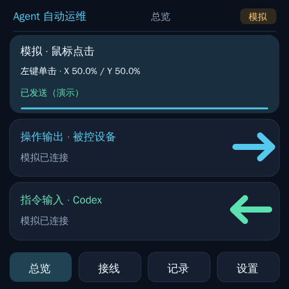

<p align="center"></p>

<h1 align="center">Agent Auto Ops</h1>
<p align="center">Let Codex see and control another computer.</p>
<p align="center"><strong>English</strong> · <a href="README.zh-CN.md">简体中文</a></p>

A plugin built for Codex. Connect the laptop running Codex to another laptop, desktop or server through **two paths: video and keyboard/mouse input**.

## 1. Video — through a capture card

**Target computer → HDMI capture card → laptop running Codex**

The target sends its video output through the capture card, so Codex can see its screen.

## 2. Keyboard and mouse — through an ESP32

**Laptop running Codex → ESP32 → target computer**

The ESP32 connects to both computers, converting Codex's input commands into USB keyboard and mouse actions (HID).

**For macOS and Windows.** The target needs video output and USB keyboard/mouse support. It does not need a remote desktop app for this connection.

**macOS has passed physical acceptance testing by the maintainer**, who confirms that video and keyboard/mouse control work correctly.

## Preview



The actual viewer UI with a synthetic desktop and connection data.



An illustration of the firmware screen layout, not a hardware photograph or an operational test.

## Tested hardware

- **UGREEN HDMI to USB-C capture card**: 2K30 specification; the plugin normally uses **720p / 5 fps**.
- A **quality, standards-compliant HDMI cable**.
- **waveshare-esp32s3-4B-touch**, formally **Waveshare ESP32-S3-Touch-LCD-4B**.

## What you need

1. An HDMI capture card; a capture resolution above 720p is recommended.
2. A quality, standards-compliant HDMI cable.
3. The specified Waveshare board, or a separately ported ESP32 board. For the wired arrangement, prefer at least two independent USB data connections and verify native USB HID support; a charge-only port does not count.

Use release firmware or compile for the specified board. Other boards need their own port and build. A single-USB board could use Bluetooth / Wi-Fi for host commands while keeping USB HID toward the target; that requires additional development.

## Recommended installation

**Open Codex and paste the [installation prompt](docs/INSTALL-PROMPT.md).** Let it clone the repository → prepare flashing tools → flash or port for your board → install the plugin → verify video and input.

Or add the marketplace manually:

```sh
codex plugin marketplace add jhckevin/codex-agent-auto-ops
```

Install **Agent Auto Ops** (English, default) or **Agent 自动运维** (Chinese) in Codex. The viewer also has an **English / 中文** switch.

[Download plugins and firmware](https://github.com/jhckevin/codex-agent-auto-ops/releases/latest) · [Wiring](docs/HARDWARE.md) · [Setup](docs/SETUP.md) · [Flash firmware](docs/FIRMWARE.md)

## What's next

Today, this is essentially a **close-range KVM**: leave the laptop running Codex beside the target computer, connect video capture and the ESP32, and let Codex operate it. For nearby use, this avoids having to combine computer use with ToDesk or a separate remote KVM connection.

### Planned improvements

- **Wireless control:** add Bluetooth / Wi-Fi command transport to support more ESP boards with wireless capabilities. Target-side HID support still needs to be checked for each board.
- **Remote KVM integration:** extend video and input over a network so the target can be controlled from a remote location.
- **Faster tools and workflows:** package common operations into quick tool calls and reusable workflows, reducing model round trips. Explore timed key sequences at the tool/device level for actions that need a faster response.
- **Better prompts and self-checks:** teach the model to check frame freshness, verify the visible result of an action, and account for latency and visual events missed between sampled frames. A successful input call alone does not establish that the intended action took effect.
- **Remote power on/off:** connect a robotic finger to press the physical power button, or an ATX power-control board for a desktop/server.

These are planned additions and improvements. Wireless transport, remote KVM integration and power control are not included in the current release.

### Limitations: timing matters

**Low consumption and low resource use** are core design constraints. The capture and model observation loop does not guarantee that every intermediate screen state will be seen. Brief events may fall between sampled frames, and capture latency, model reasoning and tool calls all take time.

The main limitation is **acting within a short time window**. A screen event may disappear before the model notices it, or the opportunity may already have passed by the time a mouse or keyboard event is sent. For example, on a computer that requires pressing **Delete during startup to enter BIOS**, the model may miss the prompt or send the key too late. The current workflow cannot guarantee success for such time-critical operations; faster tools and better prompts can help, but the resulting screen still needs to be checked.

---

[Architecture](docs/ARCHITECTURE.md) · [Compatibility and testing](docs/VALIDATION.md) · [Contributing](CONTRIBUTING.md) · [Security](SECURITY.md)

Independent community project built for Codex. [AGPL-3.0-or-later](LICENSE) · [Third-party notices](NOTICE).
