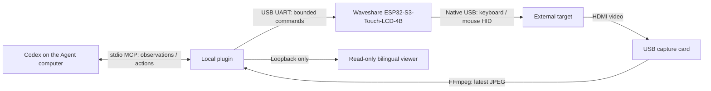

<p align="center"></p>

<h1 align="center">Agent Auto Ops</h1>
<p align="center">Give Codex eyes and hands on an external device.</p>
<p align="center"><strong>English</strong> · <a href="README.zh-CN.md">简体中文</a></p>
<p align="center">Codex plugin · HDMI capture · USB HID · ESP32-S3 firmware</p>

Agent Auto Ops connects Codex to a **physically separate computer or tablet**. Codex reads fresh HDMI images and operates the target through a hardware USB keyboard and mouse. The target does not need a remote desktop agent or a network connection for this control path.

This is an independent community project built for Codex. It is not an official OpenAI or Waveshare product. The original vector identity and quiet, lightweight UI are included as editable SVG/CSS.

## What it is for

- Bring up and maintain a lab machine through its visible desktop.
- Inspect an offline device when its remote desktop connection is unavailable.
- Exercise a device UI and verify the result in the next captured image.
- Prototype computer-use agents with explicit observation, action and recovery boundaries.

An HDMI signal and working USB HID support are required. The plugin does not bypass operating-system permissions, disk encryption or protected video output.

## How it works



The ESP32 handles input and its local status display; it does **not** carry HDMI video. Codex supplies the reasoning. There is no additional model service or separate model API key inside this plugin.

Every action references the latest observation. The harness checks target identity and frame freshness, deduplicates operation IDs, and returns an image after the action. An acknowledgement or changed image alone is not proof that the intended task succeeded.

## Hardware and compatibility

| Part | Requirement / status |
| --- | --- |
| Embedded adapter | **Waveshare ESP32-S3-Touch-LCD-4B**, ESP32-S3, 16 MiB flash, 8 MiB PSRAM, 480 × 480 touch LCD; this is the implemented board target |
| Video input | A USB HDMI capture device supported by FFmpeg; UGREEN HDMI Capture used in physical testing |
| Wiring | Target HDMI → capture → Agent computer; board UART/CH343 USB → Agent computer; board native USB → target |
| Agent computer | Node.js 20+ and FFmpeg; Windows DirectShow, macOS AVFoundation and Linux V4L2 backends exist |
| External target | HDMI output and USB HID acceptance; Android mirror mode has recorded physical tests |
| Other ESP32 boards | Porting required: display, touch, power, flash layout and USB wiring are board-specific |

Physical evidence and implementation support are different. The published acceptance record covers a Windows host, Samsung Galaxy Tab S8+ mirror mode, and firmware 0.3.3. Firmware 0.3.4 builds and model tests are available; its mobile cursor-maintenance change still needs a physical regression run. macOS/Linux hosts, iPadOS, DeX, UEFI and arbitrary capture cards are not certified by that record. See [hardware](docs/HARDWARE.md) and [validation](docs/VALIDATION.md).

## Install in Codex

Download the [latest release](https://github.com/jhckevin/codex-agent-auto-ops/releases/latest), or add this repository as a marketplace:

```sh
codex plugin marketplace add jhckevin/codex-agent-auto-ops
```

In the desktop plugin directory, select **Agent Auto Ops**, then install **Agent Auto Ops** for English or **Agent 自动运维** for Chinese. Enable one language package per adapter. Start a new chat after installation.

| Package | Default language |
| --- | --- |
| `agent-auto-ops` | **English** |
| `agent-auto-ops-zh` | 简体中文 |

These are ready-to-run packages with bundled JavaScript, using the supported Codex compatibility manifest and stdio MCP layout. Users do not need npm or a compiler. Node.js and FFmpeg must already be available on the Agent computer. This GitHub marketplace is separate from submission to the universal plugin directory. [Official plugin packaging reference](https://developers.openai.com/plugins/build/plugins).

1. Read the [hardware and firmware guide](docs/HARDWARE.md).
2. Copy a packaged example to a private configuration file and replace the serial port, adapter MAC and video device.
3. Set `AGENT_AUTO_OPS_CONFIG` to that file's absolute path before starting Codex.
4. Ask Codex to inspect the external device with `kvm_status`, then `kvm_observe`. Confirm the target identity and `simulation: false` before input.

With no configuration, the plugin deliberately starts a labelled simulator. See [setup](docs/SETUP.md) for device discovery, environment variables and troubleshooting.

## English / 中文

English is the default for this repository and primary plugin. The viewer's **English / 中文** selector switches UI text immediately and remembers the choice in that browser. A `?lang=en` or `?lang=zh-CN` URL overrides it.

The Chinese plugin supplies Chinese metadata, skill instructions and MCP descriptions. `AGENT_AUTO_OPS_LOCALE=en` or `zh-CN` overrides MCP/viewer defaults after restarting the server. Hardware text entry remains printable US ASCII; UI localization does not implement Chinese IME input.

## Firmware and development

[Build and flash firmware](docs/FIRMWARE.md) · [Architecture](docs/ARCHITECTURE.md) · [Contributing](CONTRIBUTING.md) · [Security and privacy](SECURITY.md)

```sh
npm ci --ignore-scripts
npm run build
npm test
python3 tests/serial_posix_test.py
python3 tools/package.py
node --test tools/package-smoke.test.mjs
```

Build firmware in an isolated ESP-IDF **5.4.2** environment. Do not copy a measured board's update address to an unknown device. The firmware guide separates a new installation from an update that preserves existing firmware.

The repository includes the MCP server, both plugin packages, original SVG assets, firmware source, vendored display support, tests, CI and English/Chinese guides. Private captures, credentials, original-device flash backups and historical workstation paths are excluded.

## Limits

- The viewer is read-only, bound to loopback with a random session path. Closing it does not stop the plugin.
- The video path does not capture audio. Only the latest frame and bounded event history are retained by the live viewer.
- Absolute-pointer enumeration varies by target; relative mode requires watching the real OS pointer.
- An unknown input outcome requires observing again, not blindly replaying the action.
- Firmware's local LCD currently uses its existing Chinese status labels. The selectable English/Chinese UI is the host viewer.
- This is an experimental hardware integration, not an unattended recovery or availability guarantee.

## License and acknowledgements

Project code and original artwork: **AGPL-3.0-or-later**, matching [LICENSE](LICENSE). The initial private package metadata incorrectly said GPL; the public release corrects that label without replacing the existing license text. Third-party code keeps its own license: see [NOTICE](NOTICE), firmware vendor licenses, the font license and each plugin's dependency notices.
