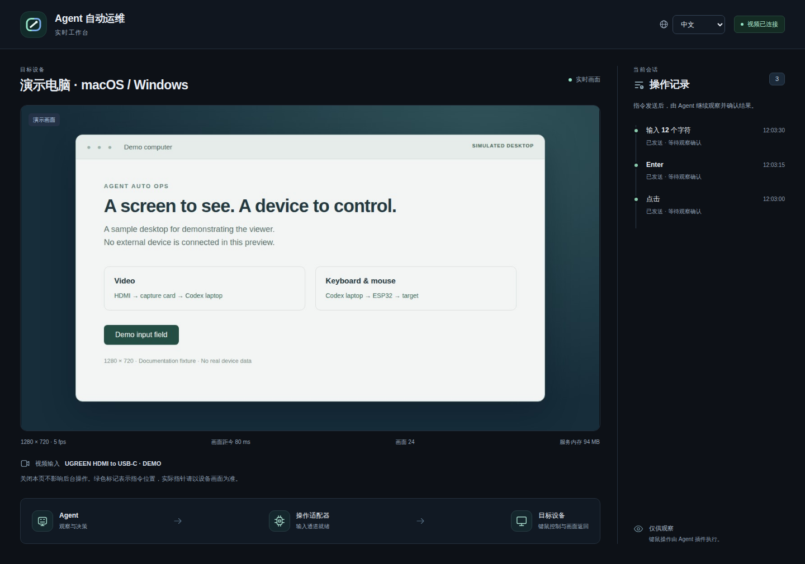

<p align="center"></p>

<h1 align="center">Agent 自动运维</h1>
<p align="center">让 Codex 看见并操作另一台电脑。</p>
<p align="center"><a href="README.md">English</a> · <strong>简体中文</strong></p>

专门为 Codex 设计的插件。把运行 Codex 的笔记本与另一台笔记本、主机或服务器连接起来，核心就是两条：**视频和键鼠控制**。

## 1. 视频：走采集卡

**被控电脑 → HDMI 采集卡 → 运行 Codex 的笔记本**

另一台电脑输出视频信号，通过采集卡接到笔记本，让 Codex 看见它的屏幕。

## 2. 键鼠：走 ESP32

**运行 Codex 的笔记本 → ESP32 → 被控电脑**

ESP32 一端连接笔记本，另一端连接被控电脑，把 Codex 的操作转换、映射成 USB 键盘和鼠标输入（HID）。

**macOS / Windows 都可以用。** 被控设备需要有视频输出，并支持 USB 键鼠；这条连接不需要在被控端安装远程桌面软件。

## 界面预览



实际查看器界面，使用演示桌面与模拟连接数据。


板载屏幕模拟图：按固件 UI 布局重绘，非实机照片或运行验证。

## 测试设备

- **UGREEN HDMI to USB-C 采集卡**：2K30 规格；插件通常按 **720P / 5fps** 使用。
- **优质、符合标准协议的 HDMI 线缆**。
- **waveshare-esp32s3-4B-touch**，正式型号为 **Waveshare ESP32-S3-Touch-LCD-4B**。

## 基础硬件

1. 一张 HDMI 采集卡，建议采集分辨率高于 720P。
2. 一条优质、符合标准协议的 HDMI 线缆。
3. 指定 Waveshare 板，或另行适配的 ESP32 板。常规有线方案优先使用至少两个独立 USB 数据连接，并确认芯片支持原生 USB HID；仅有充电口不算。

指定板可用发布固件或自行编译；其他板需要查资料、移植并单独编译。单 USB 板可探索用蓝牙 / Wi-Fi 接收主控命令、保留 USB 向被控端输出 HID，这是额外开发方向。

## 建议安装方法

**打开 Codex，把[安装提示词](docs/INSTALL-PROMPT.zh-CN.md)复制给它。** 让它从 GitHub 拉代码 → 准备烧录工具 → 按板型烧录或移植固件 → 安装插件 → 验证画面和键鼠。

也可以手动添加插件市场：

```sh
codex plugin marketplace add jhckevin/codex-agent-auto-ops
```

在 Codex 中安装 **Agent Auto Ops**（默认英文）或 **Agent 自动运维**（中文）。查看器也可以随时切换 **English / 中文**。

[下载插件与固件](https://github.com/jhckevin/codex-agent-auto-ops/releases/latest) · [接线](docs/HARDWARE.zh-CN.md) · [配置](docs/SETUP.zh-CN.md) · [烧录固件](docs/FIRMWARE.zh-CN.md)

## 展望

未来可以加入 **手指机器人**，替你按下电源键；也可以接入 **ATX 开机板**，控制主机或服务器开机，实现远程自动开机。这些是后续扩展方向，当前版本尚未包含。

---

[详细原理](docs/ARCHITECTURE.zh-CN.md) · [兼容与实测情况](docs/VALIDATION.zh-CN.md) · [参与开发](CONTRIBUTING.zh-CN.md) · [安全说明](SECURITY.zh-CN.md)

面向 Codex 的社区开源项目。[AGPL-3.0-or-later](LICENSE) · [第三方许可](NOTICE)。
