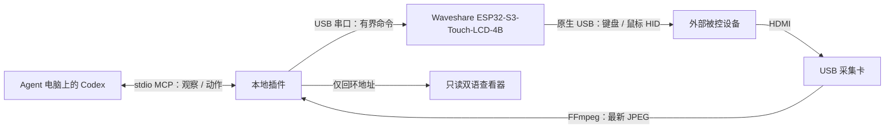

<p align="center"></p>

<h1 align="center">Agent 自动运维</h1>
<p align="center">让 Codex 看见并操作另一台设备。</p>
<p align="center"><a href="README.md">English</a> · <strong>简体中文</strong></p>
<p align="center">Codex 插件 · HDMI 采集 · USB HID · ESP32-S3 固件</p>

Agent 自动运维让 Codex 通过 **HDMI 画面和实体 USB 键鼠** 操作外部电脑或平板。被控端无需安装远程桌面客户端；这条控制链路也不依赖被控端联网。

这是专门面向 Codex 的社区项目，并非 OpenAI 或 Waveshare 官方产品。原创 SVG 标志、矢量图标和轻量界面源码均随项目提供。

## 基本用途

- 对实验室设备进行开机后的桌面配置和维护。
- 在远程桌面失效时，通过物理画面检查设备。
- 自动操作设备 UI，并用下一帧画面核实结果。
- 研究具有明确观察、执行和恢复边界的 computer-use 工作流。

设备必须能输出 HDMI 并接受 USB HID。插件不会绕过系统权限、磁盘加密或受保护视频输出。

## 基本原理



ESP32 负责键鼠输入和本机状态屏，**不传输 HDMI 视频**。Codex 负责决策，插件没有额外模型服务，也不需要另配模型 API Key。

每次动作绑定最新观察，执行前检查目标身份和帧时效，按操作 ID 去重，执行后返回画面。USB 确认或画面变化本身不等于任务成功。

## 适配设备与边界

| 部件 | 要求 / 状态 |
| --- | --- |
| 嵌入式控制板 | **Waveshare ESP32-S3-Touch-LCD-4B**；ESP32-S3、16 MiB Flash、8 MiB PSRAM、480 × 480 触摸屏，当前固件实现针对该型号 |
| 视频采集 | FFmpeg 支持的 USB HDMI 采集卡；实测使用 UGREEN HDMI Capture |
| 接线 | 目标 HDMI → 采集卡 → Agent 电脑；板卡 UART/CH343 USB → Agent 电脑；板卡原生 USB → 被控端 |
| Agent 宿主 | Node.js 20+、FFmpeg；实现了 Windows DirectShow、macOS AVFoundation、Linux V4L2 后端 |
| 被控端 | HDMI 输出与 USB HID；已有 Android 镜像模式实测记录 |
| 其他 ESP32 板型 | 需要移植显示、触摸、电源、分区与 USB 接线，不能直接认定兼容 |

实现支持与实机通过分别列出。公开验收记录覆盖 Windows 宿主、Samsung Galaxy Tab S8+ 镜像模式和 0.3.3 固件。0.3.4 固件具备构建与模型测试，其新增移动端指针保活仍需实机回归；macOS/Linux 宿主、iPadOS、DeX、UEFI 和其他采集卡未因此获得兼容认证。详见[硬件说明](docs/HARDWARE.zh-CN.md)和[验证状态](docs/VALIDATION.zh-CN.md)。

## 在 Codex 安装

下载[最新版本](https://github.com/jhckevin/codex-agent-auto-ops/releases/latest)，或添加仓库市场：

```sh
codex plugin marketplace add jhckevin/codex-agent-auto-ops
```

在桌面端插件目录选择 **Agent Auto Ops** 来源，安装英文 **Agent Auto Ops** 或中文 **Agent 自动运维**。同一控制板只启用其中一个版本，安装后开始新对话。

| 插件 | 默认语言 |
| --- | --- |
| `agent-auto-ops` | **英语** |
| `agent-auto-ops-zh` | 简体中文 |

发布包已包含 JavaScript，采用 Codex 支持的兼容清单和 stdio MCP 结构。使用者无需 npm 或编译器，但宿主需要已有 Node.js 和 FFmpeg。GitHub 市场发布与官方通用插件目录审核是两件事。[官方打包格式](https://developers.openai.com/plugins/build/plugins)。

1. 阅读[硬件和固件说明](docs/HARDWARE.zh-CN.md)。
2. 复制包内配置示例到私有文件，填入实际串口、板卡 MAC 和采集设备。
3. 启动 Codex 前将 `AGENT_AUTO_OPS_CONFIG` 指向配置的绝对路径。
4. 用 `kvm_status` 和 `kvm_observe` 核对目标身份及 `simulation: false`，再执行输入。

没有配置时会进入明确标注的模拟器。[安装指南](docs/SETUP.zh-CN.md)提供设备发现、环境变量和故障排查方法。

## 中英文切换

仓库首页和主插件默认英语。查看器右上角 **English / 中文** 可即时切换，并记住该浏览器的选择；URL 的 `?lang=en` / `?lang=zh-CN` 可显式覆盖。

中文包含中文元数据、技能说明和 MCP 描述。环境变量 `AGENT_AUTO_OPS_LOCALE=en` / `zh-CN` 可在重启后覆盖服务端默认语言。硬件文本输入仍仅支持可打印 US ASCII，界面双语不代表支持中文输入法。

## 固件与开发

[构建与烧录](docs/FIRMWARE.zh-CN.md) · [架构](docs/ARCHITECTURE.zh-CN.md) · [贡献](CONTRIBUTING.zh-CN.md) · [安全与隐私](SECURITY.zh-CN.md)

```sh
npm ci --ignore-scripts
npm run build
npm test
python3 tests/serial_posix_test.py
python3 tools/package.py
node --test tools/package-smoke.test.mjs
```

在隔离的 ESP-IDF **5.4.2** 环境构建固件。不能把某一台板卡的更新偏移照抄到未知设备；固件指南分别说明新安装与保留原固件的更新。

仓库包含 MCP 服务、两种语言插件、原创 SVG、固件源码、显示组件、测试、CI 和双语文档。私人画面、凭据、原厂整片备份与历史工作站路径不属于发布内容。

## 当前限制

- 查看器只读，监听回环地址并使用随机会话路径；关掉网页不会停止插件。
- 视频链路不采集声音，查看器仅保留最新帧和有限事件记录。
- 绝对鼠标是否枚举取决于目标；相对模式须观察真实系统指针。
- 动作结果未知时先重新观察，不应盲目重放。
- 固件本机 LCD 保留现有中文状态文字；可切换的中英文 UI 指宿主查看器。
- 当前为实验性硬件集成，不保证无人值守恢复或持续可用性。

## 许可证

项目代码与原创图形：**AGPL-3.0-or-later**，以现有 [LICENSE](LICENSE) 为准。早期私有包误写为 GPL，本次公开版本修正声明，保留原许可证正文。第三方代码沿用各自许可，详见 [NOTICE](NOTICE)、固件组件、字体和插件依赖许可文件。
